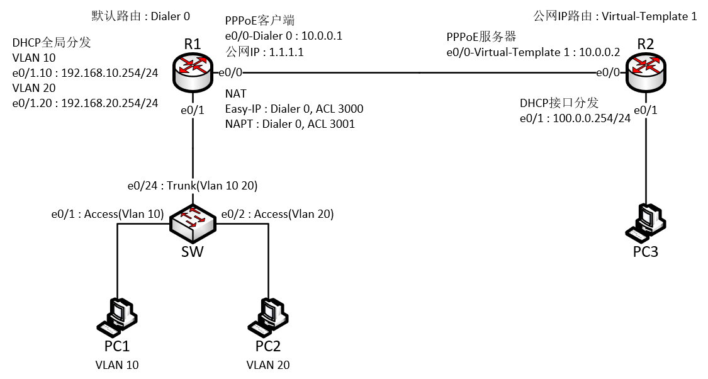
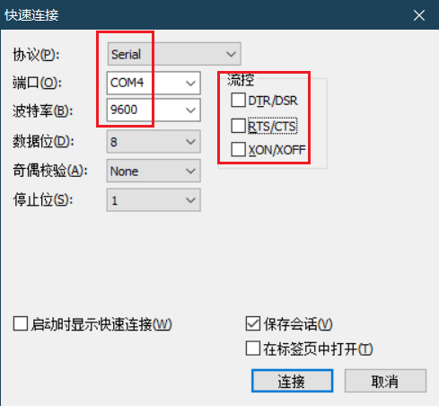

## 1. 引言
### 1.1 实验目的
进行两台路由器一台交换机的实机练习
练习内容：DHCP、单臂路由、静态/默认路由、Telnet/SSH远程管理、PPPoE、NAT、ACL
### 1.2 实验环境
管理客户机操作系统：Windows 10
串口连接软件：SecureCRT v6.5.0
### 1.3 实验设备

| 设备类型 | 设备名称                 | 数量  |
| ---- | -------------------- | --- |
| 路由器  | Quidway AR 28-11     | 2   |
| 交换机  | Quidway S2000 Series | 1   |
## 2. 网络拓扑设计
### 2.1 网络拓扑图

### 2.2 网络规划总表
- 路由器 R1
	- e0/0（Dialer 0）：10.0.0.1/30
	- 公网IP：1.1.1.1/32
	- 单臂路由
		- e0/1.10：192.168.10.254/24
		- e0/1.20：192.168.20.254/24
	- 默认路由：下一跳是PPPoE拨号接口的对端
	- VTY 0-4：用户权限等级最高、AAA验证、SSH和Telnet协议登录
	- ACL
		- ACL 3000：仅允许192.168.10.0/24网段对100.0.0.254/24网段的通信
		- ACL 3001：仅允许192.168.20.0/24网段对100.0.0.254/24网段的通信
	- NAT
		- Easy-IP：使用拨号接口IP并应用ACL 3000
		- NAPT：使用公网IP并应用ACL 3001
- 路由器 R2
	- e0/0（Virtual-Template 1）：10.0.0.2/30
	- e0/1：100.0.0.254/24
	- 静态路由：对1.1.1.1/32的路由下一跳是PPPoE虚拟模板接口对端
- 交换机 SW
	- VLAN：10、20
	- e0/1：Access接口，VLAN 10
	- e0/2：Access接口，VLAN 20
	- e0/24：Trunk接口，允许通过VLAN 10、20
- 客户端 PC1
	- VLAN 10
	- DHCP：192.168.10.0/24
- 客户端 PC2
	- VLAN 20
	- DHCP：192.168.20.0/24
- 客户端 PC3
	- DHCP：100.0.0.0/24
## 3. 配置步骤
### 3.1 串口连接电脑和网络设备
1. 插上串口连接线后，打开设备管理器查看“端口（COM和LPT）”下面出现的串口名和编号“USB-SERIAL CH340（COM4）”，这里的COM4就是串口的编号。
2. 使用SecureCRT连接到网络设备
	- 文件→快速连接
	- 
	- 协议选择Serial
	- 端口选择COM4（对于串口编号）
	- 波特率选择9600
	- 流控全不选
	- 最后连接即可
### 3.2 交换机配置
- SW：基础配置
```text
# 进行初始配置、创建VLAN
<Quidway>system-view 
Enter system view, return to user view with Ctrl+Z.
[Quidway]sysname SW
[SW]undo info-center enable 
% information center is disabled

[SW]vlan 10
[SW-vlan10]quit
[SW]vlan 20
[SW-vlan20]quit
# 配置e0/1为access接口并指定VLAN 10
[SW]interface e0/1
[SW-Ethernet0/1]port link-type access
[SW-Ethernet0/1]port access vlan 10
[SW-Ethernet0/1]quit
# 配置e0/2为access接口并指定VLAN 20
[SW]interface e0/2
[SW-Ethernet0/2]port link-type access
[SW-Ethernet0/2]port access vlan 20
[SW-Ethernet0/2]quit
# 配置e0/24为trunk接口并放行VLAN 10、20
[SW]interface e0/24
[SW-Ethernet0/24]port trunk permit vlan 10 20
 Please wait... Done.
 [SW-Ethernet0/24]quit
# 该交换机为纯二层交换机，虽然有集群功能但是路由器没有集群功能，无法进行远程管理，因此本实验中远程管理功能仅在路由器R1上实现
```
### 3.3 路由器配置
- R1：基础配置
```text
# 进行初始配置
<Quidway>system-view 
System View: return to User View with Ctrl+Z.
[Quidway]sysname R1
[R1]undo info-center enable 
% Information center is disabled
```
- R1：远程管理接口
```text
# 创建远程登录的用户
[R1]local-user caka 
New local user added.
[R1-luser-caka]password cipher 123.com
[R1-luser-caka]level 3    # 权限等级设为最高
[R1-luser-caka]service-type telnet ssh    # 服务类型选择telnet和ssh
[R1-luser-caka]quit
# 配置远程管理接口vty
[R1]user-interface vty 0 4
[R1-ui-vty0-4]authentication-mode scheme    # 启用AAA验证方式
[R1-ui-vty0-4]protocol inbound all    # 在vty接口指定协议为All（包含ssh和telnet）
[R1-ui-vty0-4]quit
# 配置SSH
[R1]rsa local-key-pair create    # 生成本地密钥
The key name will be: R1_Host
The range of public key size is (512 ~ 2048).
NOTES: If the key modulus is greater than 512,
       It will take a few minutes.
Input the bits in the modulus[default = 1024]:1024
Generating keys...
....+++.....+++.....+++......++++++.++++++.+++.++++
.....+++.....+++.....+++....+++......+++.....+++.++++++.+++.++++++.+
........+++.....+++.....++++++.++++++.++++++.++++++.+
....+++......+++....+++.....+++..........+++.........+++..........+++....+++.....+++.....+++......+++......+++.....+++.....+++.....++++++.+++++++++.++++++.++++

[R1]ssh user caka authentication-type password    # 配置SSH用户认证
# 该设备没有开启SSH服务的命令，SSH是默认开启的
```
- R1：单臂路由&DHCP
```text
# 开启DHCP
[R1]dhcp enable 
 DHCP task has already been started!
# 配置单臂路由的子接口
[R1]interface e0/1.10
[R1-Ethernet0/1.10]ip address 192.168.10.254 24
[R1-Ethernet0/1.10]vlan-type dot1q vid 10
[R1-Ethernet0/1.10]dhcp select global
[R1-Ethernet0/1.10]quit                    
[R1]interface e0/1.20
[R1-Ethernet0/1.20]ip address 192.168.20.254 24
[R1-Ethernet0/1.20]vlan-type dot1q vid 20
[R1-Ethernet0/1.20]dhcp select global
[R1-Ethernet0/1.20]quit

# 创建地址池
[R1]dhcp server ip-pool vlan10
[R1-dhcp-pool-vlan10]network 192.168.10.0 mask 255.255.255.0
[R1-dhcp-pool-vlan10]gateway-list 192.168.10.254 
[R1-dhcp-pool-vlan10]dns-list 8.8.8.8                
[R1-dhcp-pool-vlan10]quit
[R1]dhcp server ip-pool vlan20
[R1-dhcp-pool-vlan20]network 192.168.20.0 mask 255.255.255.0
[R1-dhcp-pool-vlan20]gateway-list 192.168.20.254
[R1-dhcp-pool-vlan20]dns-list 8.8.8.8
[R1-dhcp-pool-vlan20]quit
```
- R1：PPPoE客户端
```text
# 配置拨号规则和拨号接口
[R1]dialer-rule 1 ip permit 
[R1]interface Dialer 0
[R1-Dialer0]ip address ppp-negotiate
[R1-Dialer0]dialer user user-1    # 接口用户名，与进行PPP认证的用户名无关
[R1-Dialer0]dialer-group 1
[R1-Dialer0]dialer bundle 1
[R1-Dialer0]ppp chap user lhw     # PPP认证的用户名
[R1-Dialer0]ppp chap password cipher 123.com
[R1-Dialer0]quit
# 在物理接口上绑定拨号接口
[R1]interface e0/0
[R1-Ethernet0/0]pppoe-client dial-bundle-number 1 
[R1-Ethernet0/0]quit
# 配置下一跳为拨号接口的默认路由
[R1]ip route-static 0.0.0.0 0 Dialer 0
```
- R1：NAT&ACL
```text
# 配置ACL
[R1]acl number 3000
[R1-acl-adv-3000]rule 5 permit ip source 192.168.10.0 0.0.0.255 destination 100.0.0.0 0.0.0.255
[R1-acl-adv-3000]quit
[R1]acl number 3001
[R1-acl-adv-3001]rule 5 permit ip source 192.168.20.0 0.0.0.255 destination 100.0.0.0 0.0.0.255
[R1-acl-adv-3001]quit

# 拨号接口应用Easy-IP方式的NAT
[R1]interface Dialer 0
[R1-Dialer0]nat outbound 3000
[R1-Dialer0]quit
# 公网IP设置NAPT方式的NAT
[R1]nat address-group 1 1.1.1.1 1.1.1.1
[R1]interface Dialer 0
[R1-Dialer0]nat outbound 3001 address-group 1
[R1-Dialer0]quit
```
- R2：基础配置
```text
# 进行初始配置
<Quidway>system-view 
System View: return to User View with Ctrl+Z.
[Quidway]sysname R2
[R2]undo info-center enable
% Information center is disabled
```
- R2：DHCP
```text
# 开启DHCP，配置客户机的网关接口IP并应用DHCP接口分发
[R2]dhcp enable 
 DHCP task has already been started!
[R2]interface e0/1
[R2-Ethernet0/1]ip address 100.0.0.254 24
[R2-Ethernet0/1]dhcp select interface       # 接口分发DHCP
[R2-Ethernet0/1]quit
```
- R2：PPPoE服务器
```text
# 配置虚拟模板接口
[R2]interface Virtual-Template 1
[R2-Virtual-Template1]ip address 10.0.0.2 30
[R2-Virtual-Template1]remote address 10.0.0.1          # 配置分发给PPPoE客户机的IP地址
[R2-Virtual-Template1]ppp authentication-mode chap     # 设置PPP验证模式为CHAP验证
[R2-Virtual-Template1]quit
[R2]local-user lhw                # 配置本地用户用于进行PPP验证
New local user added.
[R2-luser-lhw]password cipher 123.com
[R2-luser-lhw]service-type ppp    # 用户的服务类型为PPP
[R2-luser-lhw]quit
[R2]interface e0/0
[R2-Ethernet0/0]pppoe-server bind virtual-template 1   # 在接口应用虚拟模板
```
- R2：公网IP路由
```text
# 配置R1的公网IP：1.1.1.1的路由
[R2]ip route-static 1.1.1.1 32 Virtual-Template 1
```
## 4. 测试验证
### 4.1 VLAN
- SW
```text
[SW]display vlan all 
 VLAN ID: 1
 VLAN Type: static
 Route Interface: not configured
 Description: VLAN 0001
 Tagged   Ports: none
 Untagged Ports: 
             Ethernet0/3           Ethernet0/4           Ethernet0/5           
             Ethernet0/6           Ethernet0/7           Ethernet0/8           
             Ethernet0/9           Ethernet0/10          Ethernet0/11          
             Ethernet0/12          Ethernet0/13          Ethernet0/14          
             Ethernet0/15          Ethernet0/16          Ethernet0/17          
             Ethernet0/18          Ethernet0/19          Ethernet0/20          
             Ethernet0/21          Ethernet0/22          Ethernet0/23          
             Ethernet0/24          

 VLAN ID: 10
 VLAN Type: static
 Route Interface: not configured
 Description: VLAN 0010
 Tagged   Ports: 
             Ethernet0/24          # 有VLAN标记的端口（Trunk）
 Untagged Ports: 
             Ethernet0/1           # 无VLAN标记的端口（Access）

 VLAN ID: 20
 VLAN Type: static
 Route Interface: not configured
 Description: VLAN 0020
 Tagged   Ports: 
             Ethernet0/24          # 有VLAN标记的端口（Trunk）
 Untagged Ports: 
             Ethernet0/2           # 无VLAN标记的端口（Access）

[SW]

```
### 4.2 IP地址表
- R1
```text
[R1]display brief interface 
Interface            Link      Protocol-link  Protocol type   Main IP
Aux0                 DOWN      DOWN           PPP             --
Dialer0              UP        UP (spoofing)  PPP             10.0.0.1
Ethernet0/0          UP        UP             ETHERNET        --
Ethernet0/1          UP        UP             ETHERNET        --
Ethernet0/1.10       UP        UP             ETHERNET        192.168.10.254
Ethernet0/1.20       UP        UP             ETHERNET        192.168.20.254
NULL0                UP        UP (spoofing)  NULL            --
Serial0/0            DOWN      DOWN           PPP             --
```
- R2
```text
[R2]display brief interface 
Interface            Link      Protocol-link  Protocol type   Main IP
Aux0                 DOWN      DOWN           PPP             --
Ethernet0/0          UP        UP             ETHERNET        --
Ethernet0/1          UP        UP             ETHERNET        100.0.0.254
NULL0                UP        UP (spoofing)  NULL            --
Serial0/0            DOWN      DOWN           PPP             --
Virtual-Template1    UP        UP             PPP             10.0.0.2
```
### 4.3 路由表
- R1
```text
[R1]display ip routing-table 
 Routing Table: public net
Destination/Mask   Protocol Pre  Cost        Nexthop         Interface
0.0.0.0/0          STATIC   60   0           10.0.0.1        Dialer0
10.0.0.1/32        DIRECT   0    0           127.0.0.1       InLoopBack0
10.0.0.2/32        DIRECT   0    0           10.0.0.2        Dialer0
127.0.0.0/8        DIRECT   0    0           127.0.0.1       InLoopBack0
127.0.0.1/32       DIRECT   0    0           127.0.0.1       InLoopBack0
192.168.10.0/24    DIRECT   0    0           192.168.10.254  Ethernet0/1.10
192.168.10.254/32  DIRECT   0    0           127.0.0.1       InLoopBack0
192.168.20.0/24    DIRECT   0    0           192.168.20.254  Ethernet0/1.20
192.168.20.254/32  DIRECT   0    0           127.0.0.1       InLoopBack0
```
- R2
```text
[R2]display ip routing-table 
 Routing Table: public net
Destination/Mask   Protocol Pre  Cost        Nexthop         Interface
1.1.1.1/32         STATIC   60   0           10.0.0.2        Virtual-Template1
10.0.0.0/30        DIRECT   0    0           10.0.0.2        Virtual-Template1
10.0.0.1/32        DIRECT   0    0           10.0.0.1        Virtual-Template1
10.0.0.2/32        DIRECT   0    0           127.0.0.1       InLoopBack0
127.0.0.0/8        DIRECT   0    0           127.0.0.1       InLoopBack0
127.0.0.1/32       DIRECT   0    0           127.0.0.1       InLoopBack0
```
### 4.4 DHCP测试
- R1
```text
[R1]display dhcp server tree all
GLOBAL Pool:

Pool name: vlan10
 network 192.168.10.0 mask 255.255.255.0
Sibling node:vlan20
  gateway-list 192.168.10.254 
  dns-list 8.8.8.8 

Pool name: vlan20
 network 192.168.20.0 mask 255.255.255.0
PrevSibling node:vlan10
  gateway-list 192.168.20.254 
  dns-list 8.8.8.8 
```
- PC1
```text
C:\Users\Administrator>ipconfig /all
以太网适配器 本地连接 2:

   连接特定的 DNS 后缀 . . . . . . . :
   描述. . . . . . . . . . . . . . . : Intel(R) 82579LM Gigabit Network Connecti
on
   物理地址. . . . . . . . . . . . . : 28-D2-44-1D-9E-D9
   DHCP 已启用 . . . . . . . . . . . : 是
   自动配置已启用. . . . . . . . . . : 是
   本地链接 IPv6 地址. . . . . . . . : fe80::8cd5:8c67:a130:2f7c%18(首选)
   IPv4 地址 . . . . . . . . . . . . : 192.168.10.1(首选)
   子网掩码  . . . . . . . . . . . . : 255.255.255.0
   获得租约的时间  . . . . . . . . . : 2026年7月21日 19:06:53
   租约过期的时间  . . . . . . . . . : 2026年7月22日 19:06:54
   默认网关. . . . . . . . . . . . . : 192.168.10.254
   DHCP 服务器 . . . . . . . . . . . : 192.168.10.254
   DHCPv6 IAID . . . . . . . . . . . : 556323396
   DHCPv6 客户端 DUID  . . . . . . . : 00-01-00-01-24-CA-C1-36-34-97-F6-8C-D7-A8

   DNS 服务器  . . . . . . . . . . . : 8.8.8.8
   TCPIP 上的 NetBIOS  . . . . . . . : 已启用
C:\Users\Administrator>ping 192.168.20.1

正在 Ping 192.168.20.1 具有 32 字节的数据:
来自 192.168.20.1 的回复: 字节=32 时间=1ms TTL=63
来自 192.168.20.1 的回复: 字节=32 时间=1ms TTL=63
来自 192.168.20.1 的回复: 字节=32 时间=1ms TTL=63
来自 192.168.20.1 的回复: 字节=32 时间=1ms TTL=63

192.168.20.1 的 Ping 统计信息:
    数据包: 已发送 = 4，已接收 = 4，丢失 = 0 (0% 丢失)，
往返行程的估计时间(以毫秒为单位):
    最短 = 1ms，最长 = 1ms，平均 = 1ms

C:\Users\Administrator>
```
- PC2
```text
C:\Users\Administrator>ipconfig /all
以太网适配器 本地连接 2:

   连接特定的 DNS 后缀 . . . . . . . :
   描述. . . . . . . . . . . . . . . : Intel(R) 82579LM Gigabit Network Connecti
on
   物理地址. . . . . . . . . . . . . : 00-21-CC-6B-0E-6F
   DHCP 已启用 . . . . . . . . . . . : 是
   自动配置已启用. . . . . . . . . . : 是
   本地链接 IPv6 地址. . . . . . . . : fe80::d490:ab16:c731:cefa%22(首选)
   IPv4 地址 . . . . . . . . . . . . : 192.168.20.1(首选)
   子网掩码  . . . . . . . . . . . . : 255.255.255.0
   获得租约的时间  . . . . . . . . . : 2026年7月21日 19:09:59
   租约过期的时间  . . . . . . . . . : 2026年7月22日 19:09:59
   默认网关. . . . . . . . . . . . . : 192.168.20.254
   DHCP 服务器 . . . . . . . . . . . : 192.168.20.254
   DHCPv6 IAID . . . . . . . . . . . : 587211212
   DHCPv6 客户端 DUID  . . . . . . . : 00-01-00-01-24-CA-C1-36-34-97-F6-8C-D7-A8

   DNS 服务器  . . . . . . . . . . . : 8.8.8.8
   TCPIP 上的 NetBIOS  . . . . . . . : 已启用
```
- PC3
```text
C:\Users\Administrator>ipconfig /all
以太网适配器 本地连接 2:

   连接特定的 DNS 后缀 . . . . . . . :
   描述. . . . . . . . . . . . . . . : Intel(R) 82579LM Gigabit Network Connecti
on
   物理地址. . . . . . . . . . . . . : 00-21-CC-B6-FD-C5
   DHCP 已启用 . . . . . . . . . . . : 是
   自动配置已启用. . . . . . . . . . : 是
   本地链接 IPv6 地址. . . . . . . . : fe80::fc44:629c:4736:cd94%22(首选)
   IPv4 地址 . . . . . . . . . . . . : 100.0.0.1(首选)
   子网掩码  . . . . . . . . . . . . : 255.255.255.0
   获得租约的时间  . . . . . . . . . : 2026年7月21日 19:27:17
   租约过期的时间  . . . . . . . . . : 2026年7月22日 19:27:16
   默认网关. . . . . . . . . . . . . : 100.0.0.254
   DHCP 服务器 . . . . . . . . . . . : 100.0.0.254
   DHCPv6 IAID . . . . . . . . . . . : 587211212
   DHCPv6 客户端 DUID  . . . . . . . : 00-01-00-01-24-CA-C1-36-34-97-F6-8C-D7-A8

   DNS 服务器  . . . . . . . . . . . : fec0:0:0:ffff::1%1
                                       fec0:0:0:ffff::2%1
                                       fec0:0:0:ffff::3%1
   TCPIP 上的 NetBIOS  . . . . . . . : 已启用
```
### 4.5 PPPoE测试
- R1
```text
# PPPoE链路状态UP
[R1]display pppoe-client session summary 
There is 1 session in total: 
ID   Bundle  Dialer  Intf             Client-MAC    Server-MAC    State
1    1       0       Eth0/0           000fe2394dbb  00e0fc798fba  PPPUP 
```
- R2
```text
# PPPoE链路状态UP
[R2]display pppoe-server session all
There is 1 session in total:
SID Intf                    OIntf                RemMAC       LocMAC       State
1   Virtual-Template1:0     Ethernet0/0          000fe2394dbb 00e0fc798fba UP
```
### 4.6 NAT测试
- PC1
```text
# VLAN 10客户机能ping通互联网客户机
C:\Users\Administrator>ping 100.0.0.1

正在 Ping 100.0.0.1 具有 32 字节的数据:
来自 100.0.0.1 的回复: 字节=32 时间=2ms TTL=62
来自 100.0.0.1 的回复: 字节=32 时间=2ms TTL=62
来自 100.0.0.1 的回复: 字节=32 时间=2ms TTL=62
来自 100.0.0.1 的回复: 字节=32 时间=3ms TTL=62

100.0.0.1 的 Ping 统计信息:
    数据包: 已发送 = 4，已接收 = 4，丢失 = 0 (0% 丢失)，
往返行程的估计时间(以毫秒为单位):
    最短 = 2ms，最长 = 3ms，平均 = 2ms

C:\Users\Administrator>
```
- PC2
```text
# VLAN 20客户机能ping通互联网客户机
C:\Users\Administrator>ping 100.0.0.1

正在 Ping 100.0.0.1 具有 32 字节的数据:
来自 100.0.0.1 的回复: 字节=32 时间=2ms TTL=62
来自 100.0.0.1 的回复: 字节=32 时间=2ms TTL=62
来自 100.0.0.1 的回复: 字节=32 时间=2ms TTL=62
来自 100.0.0.1 的回复: 字节=32 时间=2ms TTL=62

100.0.0.1 的 Ping 统计信息:
    数据包: 已发送 = 4，已接收 = 4，丢失 = 0 (0% 丢失)，
往返行程的估计时间(以毫秒为单位):
    最短 = 2ms，最长 = 2ms，平均 = 2ms

C:\Users\Administrator>
```
- R1：NAT转换
```text
# 查看PC1在ping互联网PC3时的NAT转换记录，192.168.10.1成功转换为拨号接口的IP地址10.0.0.1
[R1]display nat session 

There are currently 1 NAT session:
 
Protocol      GlobalAddr  Port      InsideAddr  Port        DestAddr  Port
       1        10.0.0.1 12288    192.168.10.1     1       100.0.0.1     1
 VPN:  0,        status: 20011,        TTL: 00:01:00,       Left: 00:01:00

[R1]
# 查看PC2在ping互联网PC3时的NAT转换记录，192.168.20.1成功转换为公网IP地址1.1.1.1
[R1]display nat session 

There are currently 1 NAT session:
 
Protocol      GlobalAddr  Port      InsideAddr  Port        DestAddr  Port
       1         1.1.1.1 12288    192.168.20.1     1       100.0.0.1     1
 VPN:  0,        status: 20011,        TTL: 00:01:00,       Left: 00:00:59

[R1]
```
- R1：NAT&ACL
```text
# NAT出口设置
[R1]display nat outbound 
NAT outbound information:
                           Dialer0: acl(3001) --- NAT address-group(1)
                           Dialer0: acl(3000) --- interface
# NAT地址组
[R1]display nat address-group 
NAT address-group information:
      1 : from         1.1.1.1   to         1.1.1.1
# ACL设置
[R1]display acl all 
Total ACL Number: 2

Advanced ACL  3000, 1 rule
Acl's step is 1
 rule 5 permit ip source 192.168.10.0 0.0.0.255 destination 100.0.0.0 0.0.0.255 (0 times matched) 

Advanced ACL  3001, 1 rule
Acl's step is 1
 rule 5 permit ip source 192.168.20.0 0.0.0.255 destination 100.0.0.0 0.0.0.255 (0 times matched) 
```
### 4.7 R1远程连接测试
- Telnet连接
```text
# R2上测试telnet登录
<R2>telnet 10.0.0.1
Trying 10.0.0.1 ...
Press CTRL+K to abort
Connected to 10.0.0.1 ...
********************************************************************************
*  Copyright (c) 1998-2008 Huawei Technologies Co., Ltd.  All rights reserved. *
*  Without the owner's prior written consent,                                  *
*  no decompiling or reverse-engineering shall be allowed.                     *
********************************************************************************


Login authentication


Username:caka
Password:
<R1>
```
- SSH连接
```text
# PC3测试ssh登录（由于设备太老，ssh提供的算法被现在的ssh客户端认为不安全而拒绝。所以用该条兼容老设备的命令进行登录测试）
C:\Users\10752>ssh -oKexAlgorithms=diffie-hellman-group1-sha1 -oHostKeyAlgorithms=ssh-rsa -oCiphers=aes128-cbc,3des-cbc -oMACs=hmac-sha1 caka@10.0.0.1
The authenticity of host '10.0.0.1 (10.0.0.1)' can't be established.
RSA key fingerprint is SHA256:1Wqejam9bHJU4dbxgUkGjc252mgb13ePJ74xluvIOAQ.
This key is not known by any other names.
Are you sure you want to continue connecting (yes/no/[fingerprint])? yes
Warning: Permanently added '10.0.0.1' (RSA) to the list of known hosts.
caka@10.0.0.1's password:

********************************************************************************
*  Copyright (c) 1998-2008 Huawei Technologies Co., Ltd.  All rights reserved. *
*  Without the owner's prior written consent,                                  *
*  no decompiling or reverse-engineering shall be allowed.                     *
********************************************************************************

<R1>quit
Connection to 10.0.0.1 closed.

C:\Users\10752>
```
## 5. 问题故障记录
### 5.1 PPPoE故障
- R1和R2的PPPoE链路未能成功建立
```text
# R1一直处于IDLE状态
[R1]display pppoe-client session summary 
There is 1 session in total:
ID   Bundle  Dialer  Intf             Client-MAC    Server-MAC    State
0    1       0       Eth0/0           000fe2394dbb  000000000000  IDLE
# R2没有任何连接信息
[R2]display pppoe-server session all 
There is 0 session in total:
SID Intf                    OIntf                RemMAC       LocMAC       State
```
- 排查过程
```text
# 最开始使用地址池方式分发IP（未纳入最终配置）
[R2]ip pool 1 10.0.0.1 10.0.0.1
[R2-Virtual-Template1]remote address pool 1
# R1和R2的PPPoE配置完成后，链路未能成功建立，开启日志屏显后，每隔一段时间会显示如下日志信息
# R1日志信息
[R1]info-center enable 
% Information center is enabled

[R1]
%Jun  3 08:20:05:369 2025 R1 IFNET/5/UPDOWN:Line protocol on the interface Dialer0:0 is UP  

%Jun  3 08:20:05:391 2025 R1 IFNET/5/UPDOWN:PPP IPCP protocol on the interface Dialer0:0 is UP        # IPCP开始协商
%Jun  3 08:20:05:391 2025 R1 IFNET/5/UPDOWN:PPP IPCP protocol on the interface Dialer0:0 is DOWN      # IPCP协商失败
%Jun  3 08:20:08:388 2025 R1 IFNET/5/UPDOWN:Line protocol on the interface Dialer0:0 is DOWN                # 连接断开

# R2日志信息
[R2]info-center enable 
% Information center is enabled

[R2]
%Nov  2 02:44:35:865 2023 R2 IFNET/5/UPDOWN:Line protocol on the interface Virtual-Template1:0 is UP      # LCP认证阶段成功

%Nov  2 02:44:35:884 2023 R2 IFNET/5/UPDOWN:PPP IPCP protocol on the interface Virtual-Template1:0 is UP      # IPCP开始协商
%Nov  2 02:44:35:885 2023 R2 IFNET/5/UPDOWN:Line protocol on the interface Virtual-Template1 is UP  

%Nov  2 02:44:35:887 2023 R2 IFNET/5/UPDOWN:PPP IPCP protocol on the interface Virtual-Template1:0 is DOWN    # IPCP 协商失败，回滚
%Nov  2 02:44:35:888 2023 R2 IFNET/5/UPDOWN:Line protocol on the interface Virtual-Template1 is DOWN      # 连接断开

%Nov  2 02:44:38:882 2023 R2 IFNET/5/UPDOWN:Line protocol on the interface Virtual-Template1:0 is DOWN  

# 说明PPPoE发现阶段成功了、LCP链路协商成功了、CHAP认证通过了，直到IPCP阶段失败：R2无法给R1分配IP地址，导致连接被拆除
# 可能是地址池有问题，但是该设备的地址池没有什么配置选项，所以先不用地址池，尝试直接分发对方IP
[R2]interface Virtual-Template 1
[R2-Virtual-Template1]undo remote address
[R2-Virtual-Template1]remote address 10.0.0.1
# 显示日志信息
[R1]
%Jun  3 07:50:42:352 2025 R1 IFNET/5/UPDOWN:Line protocol on the interface Dialer0:0 is UP                  # LCP认证阶段成功

%Jun  3 07:50:42:373 2025 R1 IFNET/5/UPDOWN:PPP IPCP protocol on the interface Dialer0:0 is UP q      # IPCP协商成功
```
- 问题解决
```text
# R1的PPPoE状态为PPPUP
[R1]dis pppoe-client session summary 
There is 1 session in total:
ID   Bundle  Dialer  Intf             Client-MAC    Server-MAC    State
1    1       0       Eth0/0           000fe2394dbb  00e0fc798fba  PPPUP 
# 拨号接口分发到了IP地址
[R1]display brief interface Dialer 0
Interface            Link      Protocol-link  Protocol type   Main IP
Dialer0              UP        UP (spoofing)  PPP             10.0.0.1
# R2的PPPoE状态为UP
[R2]display pppoe-server session all 
There is 1 session in total:
SID Intf                    OIntf                RemMAC       LocMAC       State
1   Virtual-Template1:0     Ethernet0/0          000fe2394dbb 00e0fc798fba UP
```
### 5.2 SSH登录连接失败
- PC3进行SSH登录时弹窗信息

- 排查过程
```text
# code：2表示连接建立失败，服务端主动断开。排查发现R1缺少SSH所需的RSA密钥对，导致服务无法正常响应客户端的连接请求
# 正确配置SSH服务
[R1]rsa local-key-pair create    # 生成本地密钥
The key name will be: R1_Host
The range of public key size is (512 ~ 2048).
NOTES: If the key modulus is greater than 512,
       It will take a few minutes.
Input the bits in the modulus[default = 1024]:1024
Generating keys...
....+++.....+++.....+++......++++++.++++++.+++.++++
.....+++.....+++.....+++....+++......+++.....+++.++++++.+++.++++++.+
........+++.....+++.....++++++.++++++.++++++.++++++.+
....+++......+++....+++.....+++..........+++.........+++..........+++....+++.....+++.....+++......+++......+++.....+++.....+++.....++++++.+++++++++.++++++.++++

[R1]ssh user caka authentication-type password    # 配置SSH用户认证
# PC3进行SSH登录测试
C:\Users\10752>ssh 10.0.0.1
Unable to negotiate with 10.0.0.1 port 22: no matching key exchange method found. Their offer: diffie-hellman-group1-sha1,diffie-hellman-group-exchange-sha1

C:\Users\10752>
# 提示未找到匹配的密钥交换方法，因为设备太老导致一些地方不兼容
# 使用兼容的命令进行登录测试
C:\Users\10752>ssh -oKexAlgorithms=diffie-hellman-group1-sha1 -oHostKeyAlgorithms=ssh-rsa -oCiphers=aes128-cbc,3des-cbc -oMACs=hmac-sha1 caka@10.0.0.1
The authenticity of host '10.0.0.1 (10.0.0.1)' can't be established.
RSA key fingerprint is SHA256:1Wqejam9bHJU4dbxgUkGjc252mgb13ePJ74xluvIOAQ.
This key is not known by any other names.
Are you sure you want to continue connecting (yes/no/[fingerprint])? yes
Warning: Permanently added '10.0.0.1' (RSA) to the list of known hosts.
caka@10.0.0.1's password:

********************************************************************************
*  Copyright (c) 1998-2008 Huawei Technologies Co., Ltd.  All rights reserved. *
*  Without the owner's prior written consent,                                  *
*  no decompiling or reverse-engineering shall be allowed.                     *
********************************************************************************

<R1>
# 问题解决
```
## 6. 相关链接
- eNSP模拟实验：[01-项目实践：华为路由器交换机模拟测试（eNSP）](01-项目实践：华为路由器交换机模拟测试（eNSP）.md)