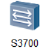
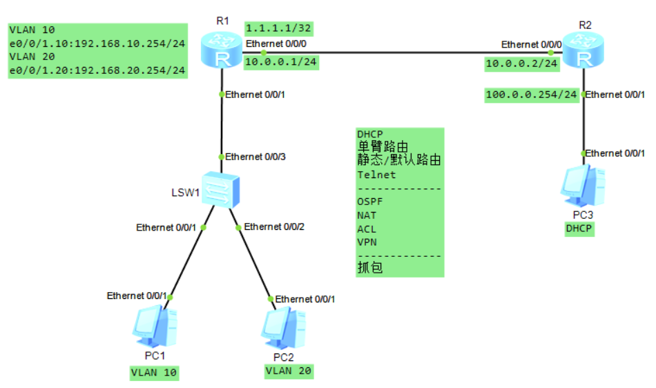

## 1. 引言
### 1.1 实验目的
进行两台路由器一台交换机的模拟练习
练习内容：DHCP、单臂路由、静态/默认路由、Telnet远程管理、OSPF、PPPoE、NAT、ACL、VPN、抓包
### 1.2 实验环境
模拟设备：eNSP
操作系统：Windows 10
### 1.3 eNSP设备

|  |  |  |
| ---------------------- | ----------------------- | ------------------- |
## 2. 网络拓扑设计
### 2.1 网络拓扑图

### 2.2 网络规划总表
- 路由器 R1
	- g0/0/0（Dialer 0）：10.0.0.1/30
	- 公网IP：1.1.1.1/32
	- 单臂路由
		- g0/0/1.10：192.168.10.254/24
		- g0/0/1.20：192.168.20.254/24
		- g0/0/1.100：192.168.100.254/24
	- 默认路由：下一跳是PPPoE拨号接口的对端
	- OSPF：Area 0通告192.168.10.0/24、192.168.20.0/24、192.168.100.0/24网段
	- ACL
		- ACL 3000：仅允许192.168.100.0/24、192.168.10.0/24网段对100.0.0.254/24网段的通信
		- ACL 3001：仅允许192.168.20.0/24网段对100.0.0.254/24网段的通信
	- NAT
		- Easy-IP：使用拨号接口IP并应用ACL 3000
		- NAPT：使用公网IP并应用ACL 3001
- 路由器 R2
	- g0/0/0（Virtual-Template 1）：10.0.0.2/30
	- g0/0/1：100.0.0.254/24
	- 静态路由：对1.1.1.1/32的路由下一跳是PPPoE虚拟模板接口对端
- 交换机
	- VLANIF 100：192.168.100.1/24（管理VLAN）
	- e0/0/1：Access接口，VLAN 10
	- e0/0/2：Access接口，VLAN 20
	- e0/0/3：Trunk接口，允许通过VLAN 10、20、100
	- OSPF：Area 0通告192.168.100.0/24网段
	- VTY 0-4：用户权限等级最高、加密密码验证
- 客户端 PC1
	- VLAN 10
	- DHCP：192.168.10.0/24
- 客户端 PC2
	- VLAN 20
	- DHCP：192.168.20.0/24
- 客户端 PC3
	- DHCP：100.0.0.0/24
## 3. 配置步骤
### 3.1 交换机配置
- 基本配置、创建VLAN、设置接口类型、配置远程登陆接口、配置VLANIF接口IP
```SW
# 进入系统视图，更改设备名并关闭屏显
<Huawei>system-view
Enter system view, return user view with Ctrl+Z.
[Huawei]sysname SW
[SW]undo info-center enable
Info: Information center is disabled.

# 创建VLAN 10和VLAN 20，以及用于OSPF通信的VLAN 100
[SW]vlan batch 10 20 100
Info: This operation may take a few seconds. Please wait for a moment...done.
# 设置e0/0/1接口为Access接口并指定VLAN 10
[SW]interface e0/0/1
[SW-Ethernet0/0/1]port link-type access 
[SW-Ethernet0/0/1]port default vlan 10
[SW-Ethernet0/0/1]quit 
# 设置e0/0/2接口为Access接口并指定VLAN 20
[SW]interface e0/0/2
[SW-Ethernet0/0/2]port link-type access 
[SW-Ethernet0/0/2]port default vlan 20
[SW-Ethernet0/0/2]quit
# 设置e0/0/3接口为Trunk接口并放行VLAN 10和VLAN 20以及VLAN 100
[SW]interface e0/0/3
[SW-Ethernet0/0/3]port link-type trunk 
[SW-Ethernet0/0/3]port trunk allow-pass vlan 10 20 100
[SW-Ethernet0/0/3]quit

# 设置远程登录vty接口，加密密码验证，用户权限设为最高
[SW]user-interface vty 0 4
[SW-ui-vty0-4]authentication-mode password 
[SW-ui-vty0-4]set authentication password cipher 123.com
[SW-ui-vty0-4]user privilege level 15
[SW-ui-vty0-4]quit
# 设置Vlanif 100虚拟接口用于OSPF通信和远程登录
[SW]interface vlanif 100
[SW-Vlanif100]ip add 192.168.100.1 24
[SW-Vlanif100]quit
```
- 配置OSPF
```SW
# 配置OSPF
[SW]ospf
[SW-ospf-1]area 0
[SW-ospf-1-area-0.0.0.0]network 192.168.100.0 0.0.0.255
[SW-ospf-1-area-0.0.0.0]quit
```
### 3.2 路由器配置
- **R1：单臂路由**
```R1
# 进入系统视图，更改设备名并关闭屏显
<Huawei>system-view
Enter system view, return user view with Ctrl+Z.
[Huawei]sysname R1
[R1]undo info-center enable 
Info: Information center is disabled.

# 配置单臂路由的子接口
[R1]dhcp enable    # 开启DHCP服务
Info: The operation may take a few seconds. Please wait for a moment.done. 
[R1]interface g0/0/1.10
[R1-GigabitEthernet0/0/1.10]ip address 192.168.10.254 24
[R1-GigabitEthernet0/0/1.10]dot1q termination vid 10
[R1-GigabitEthernet0/0/1.10]arp broadcast enable 
[R1-GigabitEthernet0/0/1.10]dhcp select global 
[R1-GigabitEthernet0/0/1.10]quit
[R1]interface g0/0/1.20
[R1-GigabitEthernet0/0/1.20]ip address 192.168.20.254 24
[R1-GigabitEthernet0/0/1.20]dot1q termination vid 20
[R1-GigabitEthernet0/0/1.20]arp broadcast enable 
[R1-GigabitEthernet0/0/1.20]dhcp select global 
[R1-GigabitEthernet0/0/1.20]quit
[R1]interface g0/0/1.100
[R1-GigabitEthernet0/0/1.100]ip address 192.168.100.254 24
[R1-GigabitEthernet0/0/1.100]dot1q termination vid 100
[R1-GigabitEthernet0/0/1.100]arp broadcast enable 
[R1-GigabitEthernet0/0/1.100]quit

# 创建VLAN 10和VLAN 20的地址池
[R1]ip pool vlan10
Info:It's successful to create an IP address pool.
[R1-ip-pool-vlan10]network 192.168.10.0 mask 24
[R1-ip-pool-vlan10]gateway-list 192.168.10.254
[R1-ip-pool-vlan10]quit
[R1]ip pool vlan20
Info:It's successful to create an IP address pool.
[R1-ip-pool-vlan20]network 192.168.20.0 mask 24
[R1-ip-pool-vlan20]gateway-list 192.168.20.254
[R1-ip-pool-vlan20]quit
```
- **R1：PPPoE客户端**
```R1
# PPPoE客户端配置拨号规则：允许所有IPv4数据通过
[R1]dialer-rule
[R1-dialer-rule]dialer-rule 1 ip permit
[R1-dialer-rule]quit
# PPPoE客户端配置拨号端口
[R1]interface dialer 0
[R1-Dialer0]ip address ppp-negotiate    # PPP协商，IP地址由服务器分配
[R1-Dialer0]dialer user user-1    # 虚拟拨号端口上启动共享DCC并指定端口名
[R1-Dialer0]dialer-group 1    # 指定该Dialer端口使用拨号规则1
[R1-Dialer0]dialer bundle 1    # 指定该Dialer端口使用的拨号捆绑为Dialer Bundle 1
# 配置客户端认证
[R1-Dialer0]ppp chap user test
[R1-Dialer0]ppp chap password cipher 123.com
[R1-Dialer0]quit
# 在物理接口上建立PPPoE会话并捆绑Dialer Bundle（拨号捆绑）
[R1]interface g0/0/0
[R1-GigabitEthernet0/0/0]pppoe-client dial-bundle-number 1
[R1-GigabitEthernet0/0/0]quit

# 配置默认路由
[R1]ip route-static 0.0.0.0 0 Dialer 0
```
- **R1：OSPF**
```R1
# 配置OSPF，并宣告默认路由
[R1]ospf
[R1-ospf-1]area 0
[R1-ospf-1-area-0.0.0.0]network 192.168.10.0 0.0.0.255
[R1-ospf-1-area-0.0.0.0]network 192.168.20.0 0.0.0.255
[R1-ospf-1-area-0.0.0.0]network 192.168.100.0 0.0.0.255
[R1-ospf-1-area-0.0.0.0]quit
[R1-ospf-1]default-route-advertise
[R1-ospf-1]quit
```
- **R1：NAT&ACL**
```R1
# 配置ACL 3000，仅允许192.168.100.0/24、192.168.10.0/24网段对100.0.0.254/24网段的通信
[R1]acl 3000
[R1-acl-adv-3000]rule 5 permit ip source 192.168.100.0 0.0.0.255 destination 10
0.0.0.0 0.0.0.255
[R1-acl-adv-3000]rule 10 permit ip source 192.168.10.0 0.0.0.255 destination 100
.0.0.0 0.0.0.255
[R1-acl-adv-3000]quit
# 配置ACL 3001，仅允许192.168.20.0/24网段对100.0.0.254/24网段的通信
[R1]acl 3001
[R1-acl-adv-3001]rule 5 permit ip source 192.168.20.0 0.0.0.255 destination 100.
0.0.0 0.0.0.255
[R1-acl-adv-3001]quit
# 配置NAT，拨号上网一般使用Easy-IP的方式，并应用ACL 3000
[R1]interface Dialer 0
[R1-Dialer0]nat outbound 3000
[R1-Dialer0]quit
# 配置NAT，方式为NAPT，使192.168.20.0/24网段的IP转换为公网IP1.1.1.1进行通信
[R1]nat address-group 1 1.1.1.1 1.1.1.1
[R1]interface Dialer 0
[R1-Dialer0]nat outbound 3001 address-group 1
[R1-Dialer0]quit
```
- **R2：PPPoE服务器**
```R2
# 进入系统视图，更改设备名并关闭屏显
<Huawei>system-view
Enter system view, return user view with Ctrl+Z.
[Huawei]sysname R2
[R2]undo info-center enable 
Info: Information center is disabled.

# 配置接口IP并开启DHCP接口分发
[R2]dhcp enable    # 开启DHCP服务
Info: The operation may take a few seconds. Please wait for a moment.done. 
[R2]interface g0/0/1
[R2-GigabitEthernet0/0/1]ip address 100.0.0.254 24
[R2-GigabitEthernet0/0/1]dhcp select interface 
[R2-GigabitEthernet0/0/1]quit

# 创建用于PPPoE分发的地址池
[R2]ip pool pool-1
Info:It's successful to create an IP address pool.
[R2-ip-pool-pool-1]network 10.0.0.0 mask 30
[R2-ip-pool-pool-1]gateway-list 10.0.0.2
[R2-ip-pool-pool-1]quit

# 创建虚拟模板接口，配置作为客户端网关的IP并关联地址池，创建登录账号
[R2]interface Virtual-Template 1
[R2-Virtual-Template1]ip address 10.0.0.2 30
[R2-Virtual-Template1]remote address pool pool-1
[R2-Virtual-Template1]ppp authentication-mode chap
[R2-Virtual-Template1]aaa
[R2-aaa]local-user test password cipher 123.com
Info: Add a new user.
[R2-aaa]quit
# 在接口应用虚拟模板接口
[R2]interface g0/0/0
[R2-GigabitEthernet0/0/0]pppoe-server bind virtual-template 1
[R2-GigabitEthernet0/0/0]quit
```
- R2：路由配置
```R2
# 配置通往给R1公网IP：1.1.1.1/32的路由
[R2]ip route-static 1.1.1.1 32 Virtual-Template 1 
```
## 4. 测试验证
### 4.1 IP地址表
- R1
```R1
[R1]display ip interface brief 
*down: administratively down
^down: standby
(l): loopback
(s): spoofing
The number of interface that is UP in Physical is 6
The number of interface that is DOWN in Physical is 1
The number of interface that is UP in Protocol is 4
The number of interface that is DOWN in Protocol is 3

Interface                         IP Address/Mask      Physical   Protocol  
Dialer0                           10.0.0.1/32          up         up(s)     
GigabitEthernet0/0/0              unassigned           up         down      
GigabitEthernet0/0/1              unassigned           up         down      
GigabitEthernet0/0/1.10           192.168.10.254/24    up         up        
GigabitEthernet0/0/1.20           192.168.20.254/24    up         up        
GigabitEthernet0/0/2              unassigned           down       down      
NULL0                             unassigned           up         up(s)     
```
- R2
```R2
[R2]display ip interface brief 
*down: administratively down
^down: standby
(l): loopback
(s): spoofing
The number of interface that is UP in Physical is 4
The number of interface that is DOWN in Physical is 1
The number of interface that is UP in Protocol is 3
The number of interface that is DOWN in Protocol is 2

Interface                         IP Address/Mask      Physical   Protocol  
GigabitEthernet0/0/0              unassigned           up         down      
GigabitEthernet0/0/1              100.0.0.254/24       up         up        
GigabitEthernet0/0/2              unassigned           down       down      
NULL0                             unassigned           up         up(s)     
Virtual-Template1                 10.0.0.2/30          up         up        
[R2]
```
- SW
```SW
[SW]display ip interface brief 
*down: administratively down
^down: standby
(l): loopback
(s): spoofing
The number of interface that is UP in Physical is 3
The number of interface that is DOWN in Physical is 1
The number of interface that is UP in Protocol is 2
The number of interface that is DOWN in Protocol is 2

Interface                         IP Address/Mask      Physical   Protocol  
MEth0/0/1                         unassigned           down       down      
NULL0                             unassigned           up         up(s)     
Vlanif1                           unassigned           up         down      
Vlanif100                         192.168.100.1/24     up         up        
```
### 4.2 VLAN划分
```SW
[SW]display vlan 
The total number of vlans is : 4
--------------------------------------------------------------------------------
U: Up;         D: Down;         TG: Tagged;         UT: Untagged;
MP: Vlan-mapping;               ST: Vlan-stacking;
#: ProtocolTransparent-vlan;    *: Management-vlan;
--------------------------------------------------------------------------------

VID  Type    Ports                                                          
--------------------------------------------------------------------------------
1    common  UT:Eth0/0/3(U)     Eth0/0/4(D)     Eth0/0/5(D)     Eth0/0/6(D)     
                Eth0/0/7(D)     Eth0/0/8(D)     Eth0/0/9(D)     Eth0/0/10(D)    
                Eth0/0/11(D)    Eth0/0/12(D)    Eth0/0/13(D)    Eth0/0/14(D)    
                Eth0/0/15(D)    Eth0/0/16(D)    Eth0/0/17(D)    Eth0/0/18(D)    
                Eth0/0/19(D)    Eth0/0/20(D)    Eth0/0/21(D)    Eth0/0/22(D)    
                GE0/0/1(D)      GE0/0/2(D)                                      

10   common  UT:Eth0/0/1(U)                                                     

             TG:Eth0/0/3(U)                                                     

20   common  UT:Eth0/0/2(U)                                                     

             TG:Eth0/0/3(U)                                                     

100  common  TG:Eth0/0/3(U)                                                     


VID  Status  Property      MAC-LRN Statistics Description      
--------------------------------------------------------------------------------

1    enable  default       enable  disable    VLAN 0001                         
10   enable  default       enable  disable    VLAN 0010                         
20   enable  default       enable  disable    VLAN 0020                         
100  enable  default       enable  disable    VLAN 0100                         
```
### 4.3 DHCP
- PC1
```cmd
PC>ipconfig

Link local IPv6 address...........: fe80::5689:98ff:fe61:80f9
IPv6 address......................: :: / 128
IPv6 gateway......................: ::
IPv4 address......................: 192.168.10.253
Subnet mask.......................: 255.255.255.0
Gateway...........................: 192.168.10.254
Physical address..................: 54-89-98-61-80-F9
DNS server........................:
PC>ping 100.0.0.254

Ping 100.0.0.254: 32 data bytes, Press Ctrl_C to break
From 100.0.0.254: bytes=32 seq=1 ttl=254 time=47 ms
From 100.0.0.254: bytes=32 seq=2 ttl=254 time=31 ms
From 100.0.0.254: bytes=32 seq=3 ttl=254 time=31 ms
From 100.0.0.254: bytes=32 seq=4 ttl=254 time=32 ms
From 100.0.0.254: bytes=32 seq=5 ttl=254 time=62 ms

--- 100.0.0.254 ping statistics ---
  5 packet(s) transmitted
  5 packet(s) received
  0.00% packet loss
  round-trip min/avg/max = 31/40/62 ms
```
- PC2
```cmd
PC>ipconfig

Link local IPv6 address...........: fe80::5689:98ff:fe7a:5a4b
IPv6 address......................: :: / 128
IPv6 gateway......................: ::
IPv4 address......................: 192.168.20.253
Subnet mask.......................: 255.255.255.0
Gateway...........................: 192.168.20.254
Physical address..................: 54-89-98-7A-5A-4B
DNS server........................:

PC>ping 192.168.10.253

Ping 192.168.10.253: 32 data bytes, Press Ctrl_C to break
Request timeout!
From 192.168.10.253: bytes=32 seq=2 ttl=127 time=63 ms
From 192.168.10.253: bytes=32 seq=3 ttl=127 time=78 ms
From 192.168.10.253: bytes=32 seq=4 ttl=127 time=78 ms
From 192.168.10.253: bytes=32 seq=5 ttl=127 time=78 ms

--- 192.168.10.253 ping statistics ---
  5 packet(s) transmitted
  4 packet(s) received
  20.00% packet loss
  round-trip min/avg/max = 0/74/78 ms
```
- PC3
```cmd
PC>ipconfig

Link local IPv6 address...........: fe80::5689:98ff:fe84:d77
IPv6 address......................: :: / 128
IPv6 gateway......................: ::
IPv4 address......................: 100.0.0.253
Subnet mask.......................: 255.255.255.0
Gateway...........................: 100.0.0.254
Physical address..................: 54-89-98-84-0D-77
DNS server........................:
```
### 4.4 Telnet
```SW
# PC设备没有telnet命令，所以用路由器进行测试
<R1>telnet 192.168.100.1
  Press CTRL_] to quit telnet mode
  Trying 192.168.100.1 ...
  Connected to 192.168.100.1 ...


Login authentication


Password:
Info: The max number of VTY users is 5, and the number
      of current VTY users on line is 1.
      The current login time is 2026-07-16 09:51:49.
<SW>
```
### 4.5 OSPF
- SW
```SW
# 查看OSPF邻居状态
[SW]display ospf peer brief 

	 OSPF Process 1 with Router ID 192.168.100.1
		  Peer Statistic Information
 ----------------------------------------------------------------------------
 Area Id          Interface                        Neighbor id      State    
 0.0.0.0          Vlanif100                        192.168.10.254   Full        
 ----------------------------------------------------------------------------
# 查看OSPF获取到的路由
[SW]display ospf routing 

	 OSPF Process 1 with Router ID 192.168.100.1
		  Routing Tables 

 Routing for Network 
 Destination        Cost  Type       NextHop         AdvRouter       Area
 192.168.100.0/24   1     Transit    192.168.100.1   192.168.100.1   0.0.0.0
 192.168.10.0/24    2     Stub       192.168.100.254 192.168.10.254  0.0.0.0
 192.168.20.0/24    2     Stub       192.168.100.254 192.168.10.254  0.0.0.0

 Routing for ASEs
 Destination        Cost      Type       Tag         NextHop         AdvRouter
 0.0.0.0/0          1         Type2      1           192.168.100.254 192.168.10.
254

 Total Nets: 4  
 Intra Area: 3  Inter Area: 0  ASE: 1  NSSA: 0 
```
- R1
```R1
# 查看OSPF邻居状态
[R1]display ospf peer brief 

	 OSPF Process 1 with Router ID 192.168.10.254
		  Peer Statistic Information
 ----------------------------------------------------------------------------
 Area Id          Interface                        Neighbor id      State    
 0.0.0.0          GigabitEthernet0/0/1.100         192.168.100.1    Full        
 ----------------------------------------------------------------------------
```
### 4.6 PPPoE
- R1
```R1
# 查看PPPoE客户端信息
[R1]display pppoe-client session summary 
PPPoE Client Session:
ID   Bundle  Dialer  Intf             Client-MAC    Server-MAC    State
1    1       0       GE0/0/0          00e0fc2c1f16  00e0fcad2cbe  UP    
# 查看虚拟拨号接口状态
[R1]display virtual-access dialer 0
Dialer0:0 current state : UP
Line protocol current state : UP 
Last line protocol up time : 2026-07-16 08:50:47 UTC-08:00
Description:HUAWEI, AR Series, Dialer0:0 Interface
Route Port,The Maximum Transmit Unit is 1500, Hold timer is 10(sec)
Link layer protocol is PPP 
LCP opened, IPCP opened
Current system time: 2026-07-16 10:14:32-08:00
    Input bandwidth utilization  :    0%
    Output bandwidth utilization :    0%
```
- R2
```R2
# 查看PPPoE服务器信息
[R2]display pppoe-server session all 
SID Intf                      State OIntf          RemMAC         LocMAC
1   Virtual-Template1:0       UP    GE0/0/0        00e0.fc2c.1f16 00e0.fcad.2cbe
# 查看虚拟模板接口状态
[R2]dis virtual-access vt 1
Virtual-Template1:0 current state : UP
Line protocol current state : UP 
Last line protocol up time : 2026-07-16 08:50:48 UTC-08:00
Description:HUAWEI, AR Series, Virtual-Template1:0 Interface
Route Port,The Maximum Transmit Unit is 1492, Hold timer is 10(sec)
Link layer protocol is PPP 
LCP opened, IPCP opened
Current system time: 2026-07-16 10:12:54-08:00
    Input bandwidth utilization  :    0%
    Output bandwidth utilization :    0%
```
### 4.7 NAT
- R1
```R1
# 查看R1的ACL列表
[R1]display acl all
 Total quantity of nonempty ACL number is 2 

Advanced ACL 3000, 3 rules
Acl's step is 5
 rule 5 permit ip source 192.168.100.0 0.0.0.255 destination 100.0.0.0 0.0.0.255 
 rule 10 permit ip source 192.168.10.0 0.0.0.255 destination 100.0.0.0 0.0.0.255
 

Advanced ACL 3001, 2 rules
Acl's step is 5
 rule 5 permit ip source 192.168.20.0 0.0.0.255 destination 100.0.0.0 0.0.0.255 
# 查看NAT公网IP地址池
[R1]display nat address-group 

 NAT Address-Group Information:
 --------------------------------------
 Index   Start-address      End-address
 --------------------------------------
 1             1.1.1.1          1.1.1.1
 --------------------------------------
  Total : 1
[R1]
# 查看R1的NAT出接口
[R1]display nat outbound 
 NAT Outbound Information:
 --------------------------------------------------------------------------
 Interface                     Acl     Address-group/IP/Interface      Type
 --------------------------------------------------------------------------
 Dialer0                      3000                       10.0.0.1    easyip  
 Dialer0                      3001                              1       pat
 --------------------------------------------------------------------------
  Total : 2
# 在PC1对PC3进行PING操作时，路由器R1的NAT网络地址转换记录
[R1]display nat session all
  NAT Session Table Information:

     Protocol          : ICMP(1)
     SrcAddr   Vpn     : 192.168.10.253                                 
     DestAddr  Vpn     : 100.0.0.254                                    
     Type Code IcmpId  : 0   8   14295
     NAT-Info
       New SrcAddr     : 10.0.0.1       # 转换为拨号接口IP
       New DestAddr    : ----
       New IcmpId      : 10258

     Protocol          : ICMP(1)
     SrcAddr   Vpn     : 192.168.10.253                                 
     DestAddr  Vpn     : 100.0.0.254                                    
     Type Code IcmpId  : 0   8   14294
     NAT-Info
       New SrcAddr     : 10.0.0.1       
       New DestAddr    : ----
       New IcmpId      : 10257

  Total : 2
# PC2对PC3进行PING操作时，路由器R1的NAT网络地址转换记录
[R1]display nat session all
  NAT Session Table Information:

     Protocol          : ICMP(1)
     SrcAddr   Vpn     : 192.168.20.253                                 
     DestAddr  Vpn     : 100.0.0.254                                    
     Type Code IcmpId  : 0   8   12259
     NAT-Info
       New SrcAddr     : 1.1.1.1        # 转换为公网IP
       New DestAddr    : ----
       New IcmpId      : 10245

     Protocol          : ICMP(1)
     SrcAddr   Vpn     : 192.168.20.253                                 
     DestAddr  Vpn     : 100.0.0.254                                    
     Type Code IcmpId  : 0   8   12261
     NAT-Info
       New SrcAddr     : 1.1.1.1        
       New DestAddr    : ----
       New IcmpId      : 10246

  Total : 2
```
## 5. 问题故障记录
### 5.1 路由器PPPoE故障
- 配置PPPoE后两端路由器没有建立连接
```R1
# PPPoE客户端信息状态正常：UP
[R1]display pppoe-client session summary 
PPPoE Client Session:
ID   Bundle  Dialer  Intf             Client-MAC    Server-MAC    State
1    1       0       GE0/0/0          00e0fc2c1f16  00e0fcad2cbe  UP    

# 客户端路由器的拨号接口没能获取到IP地址
[R1]display ip interface brief 
*down: administratively down
^down: standby
(l): loopback
(s): spoofing
The number of interface that is UP in Physical is 6
The number of interface that is DOWN in Physical is 1
The number of interface that is UP in Protocol is 4
The number of interface that is DOWN in Protocol is 3

Interface                         IP Address/Mask      Physical   Protocol  
Dialer0                           unassigned           up         up(s)     
GigabitEthernet0/0/0              unassigned           up         down      
GigabitEthernet0/0/1              unassigned           up         down      
GigabitEthernet0/0/1.10           192.168.10.254/24    up         up        
GigabitEthernet0/0/1.20           192.168.20.254/24    up         up        
GigabitEthernet0/0/2              unassigned           down       down      
NULL0                             unassigned           up         up(s)     
```

```R2
# PPPoE服务器端信息状态正常：UP
[R2]display pppoe-server session all 
SID Intf                      State OIntf          RemMAC         LocMAC
1   Virtual-Template1:0       UP    GE0/0/0        00e0.fc2c.1f16 00e0.fcad.2cbe
# 查看地址池中正在使用的IP
# 10.0.0.2是客户端的网关IP，不应该包含在里面，问题出在地址池配置上
[R2]display ip pool name pool-1 used 
  Pool-name      : pool-1
  Pool-No        : 0
  Lease          : 1 Days 0 Hours 0 Minutes
  Domain-name    : -
  DNS-server0    : -               
  NBNS-server0   : -               
  Netbios-type   : -               
  Position       : Local           Status           : Unlocked
  Gateway-0      : -               
  Mask           : 255.255.255.252
  VPN instance   : --
 -----------------------------------------------------------------------------
         Start           End     Total  Used  Idle(Expired)  Conflict  Disable
 -----------------------------------------------------------------------------
        10.0.0.1        10.0.0.2     2     1          1(0)         0        0
 -----------------------------------------------------------------------------

  Network section : 
  --------------------------------------------------------------------------
  Index              IP               MAC      Lease   Status  
  --------------------------------------------------------------------------
      1        10.0.0.2    02e0-0000-0001         11   Used       
  --------------------------------------------------------------------------

[R2]
# 给地址池分配网关地址，但是报错：IP状态错误
[R2]ip pool pool-1
[R2-ip-pool-pool-1]display this 
[V200R003C00]
#
ip pool pool-1
 network 10.0.0.0 mask 255.255.255.252 
#
return
[R2-ip-pool-pool-1]gateway-list 10.0.0.2
Error:The IP address's status is error.
# 重建地址池，强制停止PPPoE服务
[R2]undo ip pool pool-1
Warning: There are IP addresses allocated in the pool. Are you sure to delete th
e pool ?[Y/N]:y
[R2]ip pool pool-1
Info: It's successful to create an IP address pool.
[R2-ip-pool-pool-1]network 10.0.0.0 mask 30
[R2-ip-pool-pool-1]gateway-list 10.0.0.2
[R2-ip-pool-pool-1]quit
# 由于删除正在使用的地址池，应用虚拟模板接口的物理接口的自动关闭，需要重新开启
[R2]interface g0/0/0
[R2-GigabitEthernet0/0/0]undo shutdown 
[R2-GigabitEthernet0/0/0]quit
```
- 问题解决
```R1
# PPPoE客户端的拨号接口成功获取到服务器分发的IP地址
[R1]display ip interface brief 
*down: administratively down
^down: standby
(l): loopback
(s): spoofing
The number of interface that is UP in Physical is 6
The number of interface that is DOWN in Physical is 1
The number of interface that is UP in Protocol is 4
The number of interface that is DOWN in Protocol is 3

Interface                         IP Address/Mask      Physical   Protocol  
Dialer0                           10.0.0.1/32          up         up(s)     
GigabitEthernet0/0/0              unassigned           up         down      
GigabitEthernet0/0/1              unassigned           up         down      
GigabitEthernet0/0/1.10           192.168.10.254/24    up         up        
GigabitEthernet0/0/1.20           192.168.20.254/24    up         up        
GigabitEthernet0/0/2              unassigned           down       down      
NULL0                             unassigned           up         up(s)     
```

```R2
# PPPoE服务器端地址池只有一个IP，已分发给客户端
[R2]display ip pool name pool-1 used 
  Pool-name      : pool-1
  Pool-No        : 0
  Lease          : 1 Days 0 Hours 0 Minutes
  Domain-name    : -
  DNS-server0    : -               
  NBNS-server0   : -               
  Netbios-type   : -               
  Position       : Local           Status           : Unlocked
  Gateway-0      : 10.0.0.2        
  Mask           : 255.255.255.252
  VPN instance   : --
 -----------------------------------------------------------------------------
         Start           End     Total  Used  Idle(Expired)  Conflict  Disable
 -----------------------------------------------------------------------------
        10.0.0.1        10.0.0.2     1     1          0(0)         0        0
 -----------------------------------------------------------------------------

  Network section : 
  --------------------------------------------------------------------------
  Index              IP               MAC      Lease   Status  
  --------------------------------------------------------------------------
      0        10.0.0.1    02e0-0000-0001        623   Used       
  --------------------------------------------------------------------------
```
### 5.2 OSPF故障
- 交换机和路由器在配置OSPF后未能成功建立通信
```SW
# 初始配置时OSPF Router ID自动选举为VLANIF 1的192.168.1.1，后随VLANIF 100的创建更新为192.168.1.100
[SW]display ospf peer brief 

	 OSPF Process 1 with Router ID 192.168.1.1
		  Peer Statistic Information
 ----------------------------------------------------------------------------
 Area Id          Interface                        Neighbor id      State    
 ----------------------------------------------------------------------------
```

```R1
[R1]display ospf peer brief 

	 OSPF Process 1 with Router ID 192.168.10.254
		  Peer Statistic Information
 ----------------------------------------------------------------------------
 Area Id          Interface                        Neighbor id      State    
 ----------------------------------------------------------------------------
```
- 排查过程
```R1&SW
# 最初计划使用交换机的VLANIF 1设置192.168.1.0/24网段的IP，把该VLANIF接口用作OSPF通信和对交换机远程登录管理的接口。
# OSPF需要两端接口IP地址处于同一广播域，SW的VLAN 1在R1上没有对应的子接口
[R1]interface g0/0/1.1
[R1-GigabitEthernet0/0/1.1]ip address 192.168.1.254 24
[R1-GigabitEthernet0/0/1.1]dot1q termination vid 1
[R1-GigabitEthernet0/0/1.1]arp broadcast enable 
[R1-GigabitEthernet0/0/1.1]quit
# 在OSPF上宣告该子接口
[R1]ospf
[R1-ospf-1]area 0
[R1-ospf-1-area-0.0.0.0]network 192.168.1.0 0.0.0.255
[R1-ospf-1-area-0.0.0.0]quit
[R1-ospf-1]quit
# 查看SW的OSPF邻居信息，SW已经发现R1了，但是状态卡在Init
[SW]display ospf peer brief 

	 OSPF Process 1 with Router ID 192.168.1.1
		  Peer Statistic Information
 ----------------------------------------------------------------------------
 Area Id          Interface                        Neighbor id      State    
 0.0.0.0          Vlanif1                          192.168.1.254    Init        
 ----------------------------------------------------------------------------
# 查看R1的OSPF邻居信息，R1一直发现不了SW
[R1]display ospf peer brief 

	 OSPF Process 1 with Router ID 192.168.1.254
		  Peer Statistic Information
 ----------------------------------------------------------------------------
 Area Id          Interface                        Neighbor id      State    
 ----------------------------------------------------------------------------
# 交换机Trunk口的PVID默认是VLAN 1且默认放行VLAN 1。从交换机VLAN 1发出的数据帧会剥离VLAN标签，而Trunk口接收到带有VLAN 1标签的数据帧后会正常解封装交给VLANIF 1处理。
# 所以R1对VLAN 1的子接口g0/0/1.1接收不到SW发来的带有VLAN 1标签的数据帧，导致R1无法发现SW。同时SW能接收到R1发来的带VLAN 1标签的数据帧，所以SW能发现R1。但是OSPF邻居关系的建立需要双向通信（2-Way），所以SW的状态处于Init等待R1的回复确认报文，但是一直接收不到所以卡在Init状态。
# 新建一个VLAN 100，用该VLANIF接口进行OSPF通信，放弃使用VLAN 1
# 交换机配置：
[SW]vlan batch 100
[SW]interface vlanif 100
[SW-Vlanif100]ip add 192.168.100.1 24
[SW-Vlanif100]quit
[SW]interface e0/0/3
[SW-Ethernet0/0/3]port trunk allow-pass vlan 100
[SW-Ethernet0/0/3]quit
[SW]ospf
[SW-ospf-1]area 0
[SW-ospf-1-area-0.0.0.0]network 192.168.100.0 0.0.0.255
[SW-ospf-1-area-0.0.0.0]quit
[SW-ospf-1]quit
# R1新建一个对应VLAN 100的子接口，并使用OSPF通告
# 路由器R1配置：
[R1]interface g0/0/1.100
[R1-GigabitEthernet0/0/1.100]ip address 192.168.100.254 24
[R1-GigabitEthernet0/0/1.100]dot1q termination vid 100
[R1-GigabitEthernet0/0/1.100]arp broadcast enable 
[R1-GigabitEthernet0/0/1.100]quit
[R1]ospf
[R1-ospf-1]area 0
[R1-ospf-1-area-0.0.0.0]network 192.168.100.0 0.0.0.255
[R1-ospf-1-area-0.0.0.0]quit
[R1-ospf-1]quit
```
- 问题解决
```R1&SW
# 查看OSPF邻居状态（R1）
[R1]display ospf peer brief 

	 OSPF Process 1 with Router ID 192.168.10.254
		  Peer Statistic Information
 ----------------------------------------------------------------------------
 Area Id          Interface                        Neighbor id      State    
 0.0.0.0          GigabitEthernet0/0/1.100         192.168.100.1    Full        
 ----------------------------------------------------------------------------
# 查看OSPF邻居状态（SW），OSPF Router ID随VLANIF 100的创建自动更新为最大的IP地址192.168.100.1
[SW]display ospf peer brief 

	 OSPF Process 1 with Router ID 192.168.100.1
		  Peer Statistic Information
 ----------------------------------------------------------------------------
 Area Id          Interface                        Neighbor id      State    
 0.0.0.0          Vlanif100                        192.168.10.254   Full        
 ----------------------------------------------------------------------------
```
### 5.3 NAT故障
- R1的NAPT方式的NAT转换失败
```cmd
# PC2是192.168.20.0/24网段，使用NAPT方式转换为公网IP：1.1.1.1进行通信，但是PING失败
PC>ping 100.0.0.254

Ping 100.0.0.254: 32 data bytes, Press Ctrl_C to break
Request timeout!
Request timeout!
Request timeout!
Request timeout!
Request timeout!

--- 100.0.0.254 ping statistics ---
  5 packet(s) transmitted
  0 packet(s) received
  100.00% packet loss
```
- 排查过程
```R1
# 最初计划对ACL 3000设置rule 100 deny ip（未纳入最终配置），拒绝所有IP。而同一个端口应用多个nat outbound时，会按照ACL编号从小到大依次进行匹配，所以192.168.20.0/24网段的数据包在先匹配ACL 3000时被rule 100匹配到deny，因此不进行NAT转换，直接路由转发出去了。从而不会继续匹配ACL 3001的规则。所以ACL 3000不需要添加rule 100拒绝所有IP
# 删除rule 100规则
[R1]acl 3000
[R1-acl-adv-3000]undo rule 100
[R1-acl-adv-3000]quit
```
- 问题解决
```cmd
# PC2成功访问到互联网主机
PC>ping 100.0.0.254

Ping 100.0.0.254: 32 data bytes, Press Ctrl_C to break
From 100.0.0.254: bytes=32 seq=1 ttl=254 time=63 ms
From 100.0.0.254: bytes=32 seq=2 ttl=254 time=31 ms
From 100.0.0.254: bytes=32 seq=3 ttl=254 time=47 ms
From 100.0.0.254: bytes=32 seq=4 ttl=254 time=31 ms
From 100.0.0.254: bytes=32 seq=5 ttl=254 time=47 ms

--- 100.0.0.254 ping statistics ---
  5 packet(s) transmitted
  5 packet(s) received
  0.00% packet loss
  round-trip min/avg/max = 31/43/63 ms
# PC2是转换到公网IP：1.1.1.1进行通信的
[R1]display nat session all
  NAT Session Table Information:

     Protocol          : ICMP(1)
     SrcAddr   Vpn     : 192.168.20.253                                 
     DestAddr  Vpn     : 100.0.0.254                                    
     Type Code IcmpId  : 0   8   12259
     NAT-Info
       New SrcAddr     : 1.1.1.1        
       New DestAddr    : ----
       New IcmpId      : 10245

     Protocol          : ICMP(1)
     SrcAddr   Vpn     : 192.168.20.253                                 
     DestAddr  Vpn     : 100.0.0.254                                    
     Type Code IcmpId  : 0   8   12261
     NAT-Info
       New SrcAddr     : 1.1.1.1        
       New DestAddr    : ----
       New IcmpId      : 10246

  Total : 2
```